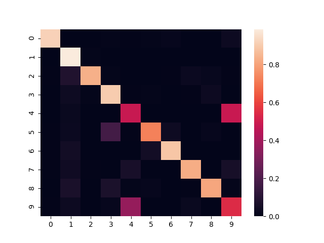

# pt-sdae
PyTorch implementation of a version of the Stacked Denoising AutoEncoder.

## Examples

An example using MNIST data can be found in the examples/mnist/mnist.py which achieves around 80% accuracy using
k-Means on the encoded values.

Here is an example confusion matrix.

Currently this code is used in a PyTorch implementation of DEC, see https://github.com/vlukiyanov/pt-dec.

MIT License
